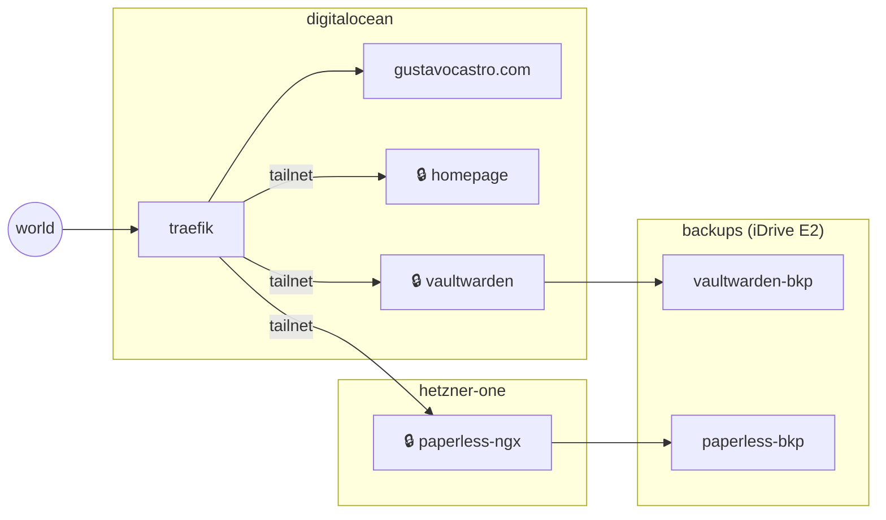

```mermaid
flowchart LR
    subgraph subGraph0["backups (iDrive E2)"]
        vaultwarden-bkp["vaultwarden-bkp"]
        paperless-bkp["paperless-bkp"]
    end
    subgraph digitalocean["digitalocean"]
        gustavocastro.com["gustavocastro.com"]
        traefik["traefik"]
        homepage["🔒 homepage"]
        vaultwarden["🔒 vaultwarden"]
    end
    subgraph s1["hetzner-one"]
        paperless-ngx["🔒 paperless-ngx"]
    end

    n1 --> traefik --> gustavocastro.com
    traefik --> |tailnet| homepage & vaultwarden & paperless-ngx
    n1((world))

    vaultwarden --> vaultwarden-bkp
    paperless-ngx --> paperless-bkp
```